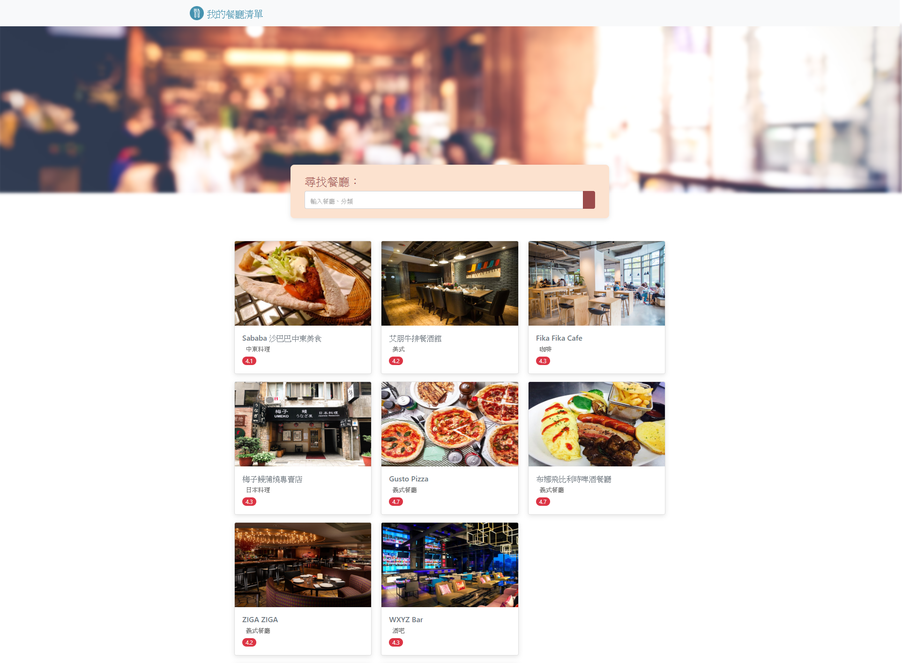
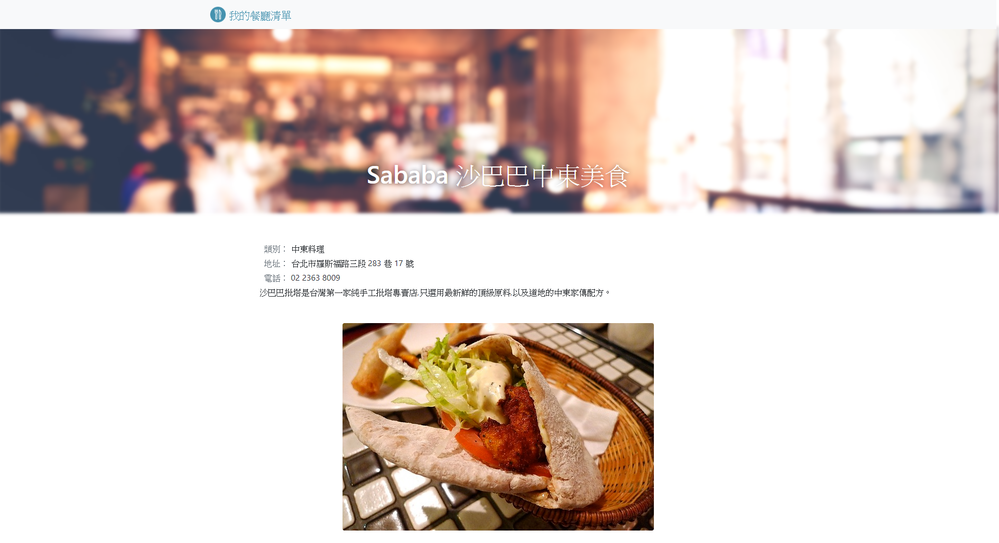

# Restaurant list

This is a restaurant list demo which built up from [Alphacamp](https://tw.alphacamp.co/) semester 3 assignment.





## Update
1. Add RESTful CRUD design to restaurant list 
2. Add search and sorting feature in index page

## Installing

### Git bash

#### git clone

`git clone` to clone the project

```markdown
git clone https://github.com/mpragnarok/restaurant-list.git
```

### Command line

#### npm install

Install all the packages in the project.

#### npm run dev

Start the server with **nodemon** command.

#### npm run start

Start the server with node command.

#### CTRL + C twice

Stop the server

### Browser

Head to [http://localhost:3000](http://localhost:3000) to experience the restaurant list demo.

## Feature

​	The page has a dynamic index to show up the content of web page which contains front-end and back-end techniques. Front-end part is written in **JavaScript**, **CSS** and **HTML** with **Bootstrap**, back-end part is written in **Node.js** and **Express.js**, server side uses  **MongoDB** with **Mongoose**.  

​	The dynamic webpage is made up by **handlebars**. On top of that, it includes search feature which can search with Chinese, English(Uppercase or lowercase) and category of restaurant. 

## packages

#### dependencies

1. express
2. express-handlebars
3. mongodb
4. mongoose
5. method-override
6. body-parser


#### devDependency

1. nodemon